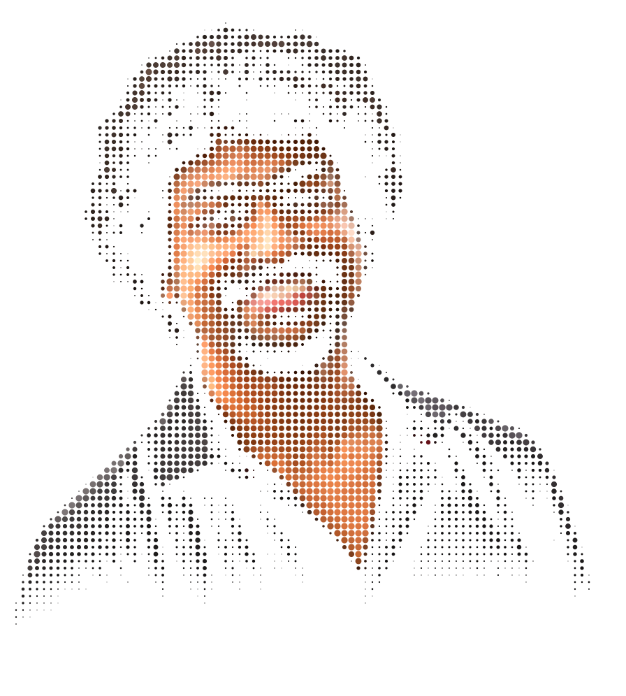
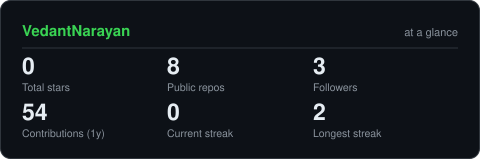
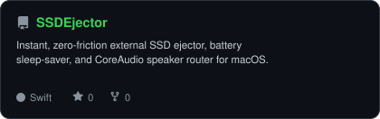
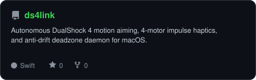
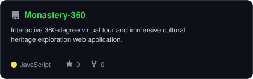
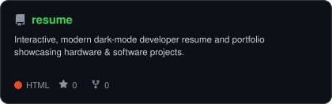

<div align="center">

<!-- PORTRAIT - generated by scripts/dotify.py from assets/studio_black_cutout.png -->


<br>

<!-- NAME / TAGLINE - animated typing -->
<a href="https://github.com/VedantNarayan">
  
</a>

<br>

<!-- SOCIALS -->
<a href="https://www.linkedin.com/in/vedant-narayan-5b865b325"></a>
<a href="https://instagram.com/vedant.ide"></a>
<a href="mailto:vedantnarayan13@gmail.com"></a>
<a href="https://vedantnarayan.github.io/resume/"></a>

<a href="https://github.com/VedantNarayan">
  
</a>

</div>

---

## `~/` whoami

```console
$ cat about.txt
```

Hi, I'm **Vedant Narayan**. I build solutions at the intersection of **IoT, hardware engineering, and systems software**, and design 3D models and mechanics when circuits need a physical home.

- 🛠️ Currently building **[SSDEjector](https://github.com/VedantNarayan/SSDEjector)** and **[ds4link](https://github.com/VedantNarayan/ds4link)**
- 🎓 **B.Tech CSE** — Amity University Patna
- 🌐 Portfolio: **[vedantnarayan.github.io/resume](https://vedantnarayan.github.io/resume/)**
- ⚡ Focus: **IoT & Smart Devices, Embedded Systems, Robotics & CAD Modeling**
- 💡 Fun fact: **I build hardware hacks and native utilities for problems I want solved.**

<br>

<div align="center">

## `~/` toolbox


</div>

---

<div align="center">

## `~/` skill radar

<table>
<tr>
<td width="50%" align="center" valign="middle">

<!-- Self-rated radar - edit assets/skills.json, the workflow redraws it -->
<picture>
  <source media="(prefers-color-scheme: dark)"  srcset="assets/radar-dark.svg">
  <source media="(prefers-color-scheme: light)" srcset="assets/radar-light.svg">
  
</picture>

</td>
<td width="50%" align="center" valign="middle">

<!-- Live radar built from real language byte counts across your repos -->
<picture>
  <source media="(prefers-color-scheme: dark)"  srcset="assets/radar-langs-dark.svg">
  <source media="(prefers-color-scheme: light)" srcset="assets/radar-langs-light.svg">
  
</picture>

</td>
</tr>
</table>

</div>

---

<div align="center">

## `~/` contribution calendar

<!-- 3D isometric calendar, regenerated every 6h by .github/workflows/metrics.yml -->


<br><br>

<!-- Snake eats the contribution graph - .github/workflows/snake.yml -->
<picture>
  <source media="(prefers-color-scheme: dark)"  srcset="https://raw.githubusercontent.com/VedantNarayan/VedantNarayan/output/snake-dark.svg">
  <source media="(prefers-color-scheme: light)" srcset="https://raw.githubusercontent.com/VedantNarayan/VedantNarayan/output/snake.svg">
  
</picture>

</div>

---

<div align="center">

## `~/` the numbers

<!-- Generated by scripts/cards.py into this repo -->
<picture>
  <source media="(prefers-color-scheme: dark)"  srcset="assets/card-stats-dark.svg">
  <source media="(prefers-color-scheme: light)" srcset="assets/card-stats-light.svg">
  
</picture>

<br>


<br><br>


</div>

---

<div align="center">

## `~/` selected work

<!-- Cards generated by scripts/cards.py from assets/projects.json.
     Stars, forks and language are pulled live from the API on every run. -->
<table>
<tr>
<td width="50%">
  <a href="https://github.com/VedantNarayan/SSDEjector">
    <picture>
      <source media="(prefers-color-scheme: dark)"  srcset="assets/card-SSDEjector-dark.svg">
      <source media="(prefers-color-scheme: light)" srcset="assets/card-SSDEjector-light.svg">
      
    </picture>
  </a>
</td>
<td width="50%">
  <a href="https://github.com/VedantNarayan/ds4link">
    <picture>
      <source media="(prefers-color-scheme: dark)"  srcset="assets/card-ds4link-dark.svg">
      <source media="(prefers-color-scheme: light)" srcset="assets/card-ds4link-light.svg">
      
    </picture>
  </a>
</td>
</tr>
<tr>
<td width="50%">
  <a href="https://github.com/VedantNarayan/Monastery-360">
    <picture>
      <source media="(prefers-color-scheme: dark)"  srcset="assets/card-Monastery-360-dark.svg">
      <source media="(prefers-color-scheme: light)" srcset="assets/card-Monastery-360-light.svg">
      
    </picture>
  </a>
</td>
<td width="50%">
  <a href="https://github.com/VedantNarayan/resume">
    <picture>
      <source media="(prefers-color-scheme: dark)"  srcset="assets/card-resume-dark.svg">
      <source media="(prefers-color-scheme: light)" srcset="assets/card-resume-light.svg">
      
    </picture>
  </a>
</td>
</tr>
</table>

<sub>

| project | live | stack |
|---|---|---|
| **[SSDEjector](https://github.com/VedantNarayan/SSDEjector)** | [GitHub Release](https://github.com/VedantNarayan/SSDEjector/releases) | `Swift` `macOS` `CoreAudio` |
| **[ds4link](https://github.com/VedantNarayan/ds4link)** | [GitHub Release](https://github.com/VedantNarayan/ds4link/releases) | `Swift` `CoreHaptics` `GameController` |
| **[Monastery-360](https://github.com/VedantNarayan/Monastery-360)** | [Web App](https://github.com/VedantNarayan/Monastery-360) | `JavaScript` `React` `360 VR` |
| **[resume](https://github.com/VedantNarayan/resume)** | [vedantnarayan.github.io/resume](https://vedantnarayan.github.io/resume/) | `HTML` `CSS` `JavaScript` |

</sub>

</div>

---

<div align="center">

<sub>`01110100 01101000 01100001 01101110 01101011 01110011 00100000 01100110 01101111 01100110 01110010 00100000 01110011 01100011 01110010 01101111 01101100 01101100 01101001 01101110 01100111`</sub>

</div>
